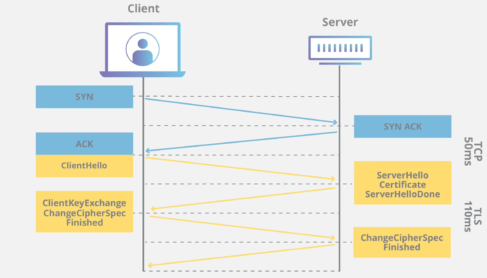

### Symmetric and Asymmetric Encryption

The goal of SSL/TLS is to achieve secure symmetric encryption, while it uses asymmetric encryption during TLS handshake.

**The reason why it uses symmetric encryption is performance.** Symmetric encryption (AES) is significantly faster than asymmetric encryption. Asymmetric can only handle small data chunks, while symmetric can efficiently process bulk data. **Asymmetric is used only for the handshake to solve the key distribution problem.**

### TLS Handshake Steps with RSA

TLS handshake happens after TCP handshake, and here is step by step:

1. **Client Hello**: Client sends supported TLS version, cipher suites, and "client random" string.
2. **Server Hello**: Server sends chosen TLS version, cipher suite, and "server random" string.
3. **Server Certificate**: Server sends SSL Certificate.
4. **Certificate Authentication**: Client authenticates server using the SSL certificate.
5. **Premaster Secret**: Client encrypts premaster secret using public key from SSL certificate and sends it to server.
6. **Session Key Generation**: Both generate session key using client random, server random, and premaster secret.
    - Client has all three values.
    - Server has client random and server random, then decrypts premaster secret using certificate's private key.
7. **Client Ready**: Client signals it's ready to begin encrypted communication.
8. **Server Ready**: Server signals it's ready to begin encrypted communication.
9. **Secure Symmetric Encryption Achieved**.

This describes only the RSA key exchange algorithm for a "full handshake". RSA key exchange is not supported in TLSv1.3 and is considered insecure. (TODO: reasons for insecurity)

### Reference

[What happens in a TLS handshake? | SSL handshake | Cloudflare](https://www.cloudflare.com/learning/ssl/what-happens-in-a-tls-handshake/)
